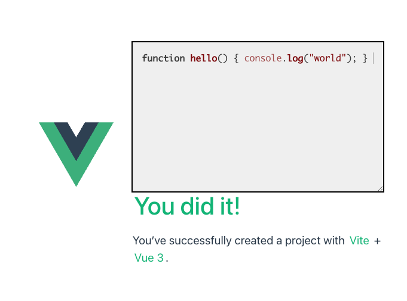
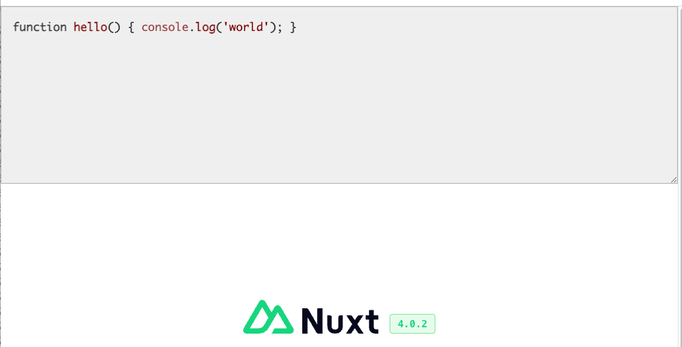

+++
title = 'How to use code-input and highlight.js with Vue or Nuxt'
+++

# How to use code-input and highlight.js with Vue or Nuxt

> Contributors: 2025 Paul Rosen

Vue and Nuxt have some similarities, but there is one big difference in how they can use this library. In Nuxt there is server side rendering (SSR) that will attempt to create the final HTML before sending the page to the browser. This cannot use any browser-specific things so the `code-input` component must be excluded from rendering until hydration in the browser.
 
## Vue

### 1. Create a Vue app

First, create a Vue project. (If you already have a Vue project then you can skip this step). On a command line, type this:
```bash
npm create vue@latest
```
At the time this tutorial was created, the output was the following, after I named the project `syntax-highlighter` and checked "typescript":
```plaintext
Need to install the following packages:
create-vue@3.18.0
Ok to proceed? (y) y


> npx
> "create-vue"

┌  Vue.js - The Progressive JavaScript Framework
│
◇  Project name (target directory):
│  syntax-highlighter
│
◇  Select features to include in your project: (↑/↓ to navigate, space to select, a to toggle
all, enter to confirm)
│  TypeScript
│
◇  Select experimental features to include in your project: (↑/↓ to navigate, space to
select, a to toggle all, enter to confirm)
│  none
│
◇  Skip all example code and start with a blank Vue project?
│  No

Scaffolding project in /srv/app/projects/syntax-highlighter...
│
└  Done. Now run:

   cd syntax-highlighter
   npm install
   npm run dev

| Optional: Initialize Git in your project directory with:

   git init && git add -A && git commit -m "initial commit"
```

And just like the above instructions mention, do the following:
```bash
cd syntax-highlighter
npm install
npm run dev
```

You should be able to open your browser to the path that it prints out and see a working Vue app. If so, congratulations! Hit Ctrl-C to stop it.

### 2. Add dependencies

> This tutorial will use `highlight.js` for the syntax highlighting. If you are using a different method then adjust as needed.

Type this:
```bash
npm install @webcoder49/code-input
npm install highlight.js
```

In the file `vite.config.ts`, change the line that contains `vue()` to this:
```javascript
vue({
  template: {
    compilerOptions: {
      isCustomElement: (tag) => tag === 'code-input'
    }
  }
})
```

So that Vue knows that `code-input` is not a Vue component.

### 3. Initialize the textarea

Create a component with whatever name you want. Perhaps `RichEditor.vue`. Paste the following into it:
```html
<template>
  <code-input name="richText">function hello() { console.log("world"); }
  </code-input>
</template>

<script lang="ts" setup>
import {onMounted} from "vue";
// For loading the code-input web component
import codeInput from "@webcoder49/code-input";
import Template from "@webcoder49/code-input/templates/hljs.mjs";
// For loading a highlighting engine - this example uses highlight.js
import hljs from 'highlight.js/lib/core';
import javascript from 'highlight.js/lib/languages/javascript';

onMounted(async () => {
  // Set up the highlighting engine first
  hljs.registerLanguage('javascript', javascript);
  // Register that engine with code-input
  codeInput.registerTemplate("syntax-highlighted", new Template(hljs, []));
})

</script>

<style>
/* These are necessary styles to make code-input work */
@import '@webcoder49/code-input/code-input.css';
/* This is one possibility of styles to use for highlighting */
@import 'highlight.js/styles/default.min.css';

code-input {
  resize: both; /* if you want the resizing control that textarea has */
  margin: 0; /* you can override other styles */
  font-family: Monaco, monospace;
}

.hljs {
  background: #f1f1f1; /* here's how to change the background color. */
}
</style>
```

### 4. Using the component

In the generated file `HelloWorld.vue`, place the following line after the "greetings" line:
```html
<RichEditor />
```

And put its import in the `<script>` section:
```html
import RichEditor from "@/components/RichEditor.vue";
```

Restart the server:
```bash
npm run dev
```

If all went well, you should see the following in the browser:



## Nuxt

### 1. Create a Nuxt app

First, create a Nuxt project. (If you already have a Nuxt project then you can skip this step). On a command line, type this:
```bash
npm create nuxt@latest syntax-highlighter
```
At the time this tutorial was created, the output was the following:
```plaintext
Need to install the following packages:
create-nuxt@3.27.0
Ok to proceed? (y) y


> npx
> "create-nuxt" syntax-highlighter


        .d$b.
       i$$A$$L  .d$b
     .$$F` `$$L.$$A$$.
    j$$'    `4$$:` `$$.
   j$$'     .4$:    `$$.
  j$$`     .$$:      `4$L
 :$$:____.d$$:  _____.:$$:
 `4$$$$$$$$P` .i$$$$$$$$P`

ℹ Welcome to Nuxt!
ℹ Creating a new project in syntax-highlighter.

✔ Which package manager would you like to use?
npm
◐ Installing dependencies...

> postinstall
> nuxt prepare

✔ Types generated in .nuxt

added 882 packages, and audited 884 packages in 5m

185 packages are looking for funding
  run `npm fund` for details

found 0 vulnerabilities
✔ Installation completed.

✔ Initialize git repository?
No

✔ Would you like to install any of the official modules?
Yes

✔ Pick the modules to install:
none

✨ Nuxt project has been created with the v4 template. Next steps:
 › cd syntax-highlighter
 › Start development server with npm run dev

```

And just like the above instructions mention, do the following:
```bash
cd syntax-highlighter
npm run dev
```

You should be able to open your browser to the path that it prints out and see a working Nuxt app. If so, congratulations! Hit Ctrl-C to stop it.

### 2. Add dependencies

> This tutorial will use `highlight.js` for the syntax highlighting. If you are using a different method then adjust as needed.

Type this:
```bash
npm install @webcoder49/code-input
npm install highlight.js
```

In the file `vite.config.ts`, after the line `compatibilityDate`, add this so that Vue knows that `code-input` is not a Vue component:

```javascript
vue: {
  compilerOptions: {
    isCustomElement: (tag) => tag === "code-input",
  },
},
```

Also add this:
```javascript
css: ['@webcoder49/code-input/code-input.css', 'highlight.js/styles/default.min.css'],
```

So that the necessary css is loaded for code-input, and an example theme is loaded. 

> You might want to replace the second file with your own theme, but you need the first file.

### 3. Initialize the textarea

Create a component with whatever name you want. Perhaps `app/components/RichEditor.vue`. Paste the following into it:

```html
<template>
  <div class="rich-editor">
    <!-- Use ClientOnly so that no SSR is done on the code-input component -->
    <ClientOnly>
      <code-input
        ref="elem"
        :name="name"
        :value="value"
        spellcheck="false"
        @input="emit('input', $event.target.value)"
        @code-input_load="loaded"
      ></code-input>
    </ClientOnly>
  </div>
</template>

<script lang="ts" setup>
// For loading a highlighting engine - this example uses highlight.js
import hljs from 'highlight.js/lib/core';
import javascript from 'highlight.js/lib/languages/javascript';

// The following are optional.
const emit = defineEmits<{
  // If you want a listener when the user changes the contents.
  (e: "input", value: string): void;
  // If you want to do more initialization after code-input is ready.
  (e: "ready", textarea: HTMLElement): void;
}>();

const props = defineProps<{
  value: string; // The starting value for the textarea
  name: string; // The name that is used when the textarea is in a form
}>();

// This contains the HTMLElement of the code-input component
const elem = ref()

// Before it appears on the page, code-input needs to be initialized.
// This must be onBeforeMount and not onMount!
onBeforeMount(async () => {
  // Only if we're in the client
  if (import.meta.browser) {
    // Dynamically import code-input so that it is only in the browser
    const codeInput = await import("@webcoder49/code-input");
    const Template = (await import("@webcoder49/code-input/templates/hljs.mjs")).default;
    // Set up highlight.js
    hljs.registerLanguage('javascript', javascript);
    // Register that engine with code-input
    codeInput.registerTemplate("syntax-highlighted", new Template(hljs, []));
  }
})

function loaded() {
  // This is called after the code-input is initialized and it has created a textarea.
  // If you have some further initialization for the textarea, then do it in this event.
  const ta = elem.value.querySelector('textarea')
  emit("ready", ta)
}
</script>

<style scoped>
.rich-editor {
  border: 1px solid #bbbbbb;
}
code-input {
  resize: both; /* if you want the resizing control that textarea has */
  margin: 0; /* you can override other styles */
  font-family: "Fira Mono", Monaco, monospace;
}
</style>

<style>
/* Notice that these styles aren't scoped */
.hljs {
  background: #f1f1f1;  /* here's how to change the background color. */
}
/* If you want to change the selection color */
code-input textarea::selection {
  background: #6781ef;
  color: #ffffff;
}
</style>
```
### 4. Using the component

In the generated file `app.vue`, place the following line after the "NuxtRouteAnnouncer" line:
```html
<RichEditor value="function hello() { console.log('world'); }" name="myEditor" />
```

And put its import in the `<script>` section:
```html
import RichEditor from "./components/RichEditor.vue";
```

Restart the server:
```bash
npm run dev
```

If all went well, you should see the following in the browser:


