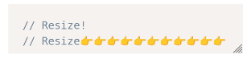

+++
title = 'Styling `code-input` elements with CSS'
+++

# Styling `code-input` elements with CSS

> Contributors: 2025 Oliver Geer

`code-input` elements can be styled like `textarea` elements in most cases; however, there are some exceptions:
* The CSS variable `--padding` should be used rather than the property `padding` (e.g. `<code-input style="--padding: 10px;">...`), or `--padding-left`, `--padding-right`, `--padding-top` and `--padding-bottom` instead of the CSS properties of the same names. For technical reasons, the value must have a unit (i.e. `0px`, not `0`). To avoid overcomplicating the code, this padding is always *included in* any width/heights of `code-input` elements, so if you want to style `textarea`s and `code-input` elements with best consistency set `box-sizing: border-box` on them.
* Background colours set on `code-input` elements will not work with highlighters that set background colours themselves - use `(code-input's selector) pre[class*="language-"]` for Prism.js or `.hljs` for highlight.js to target the highlighted element with higher specificity than the highlighter's theme. You may also set the `background-color` of the code-input element for its appearance when its template is unregistered / there is no JavaScript.
* The caret and placeholder colour by default follow and give good contrast with the highlighted theme. Setting a CSS rule for `color` and/or `caret-color` properties on the code-input element will override this behaviour.
* For technical reasons, `code-input:focus` won't match anything. Use `code-input:has(textarea:focus)` instead.
* For now, elements on top of `code-input` elements should have a CSS `z-index` at least 3 greater than the `code-input` element.

Please do **not** use `className` in JavaScript referring to code-input elements, because the code-input library needs to add its own classes to code-input elements for easier progressive enhancement. You can, however, use `classList` and `style` as much as you want - it will make your code cleaner anyway.

## Methods of resizing

`code-input` elements default to having a fixed height and filling the width of their container while the code inside scrolls, and you can set the ordinary CSS properties (for example `height` and `width`) to change this size. You can also make the size more flexible using CSS:

* The [CSS `resize` property (see link)](https://developer.mozilla.org/en-US/docs/Web/CSS/Reference/Properties/resize) can be used on `code-input` elements to give them the manual resizing handle `textarea`s often come with, when the web browser supports it. For example, `<code-input style="resize: both;"`... gives:

* You can also make a `code-input` element resize automatically to fit its contents - use [the Autogrow plugin](../../plugins/#playground-preset-autogrow) for that.
